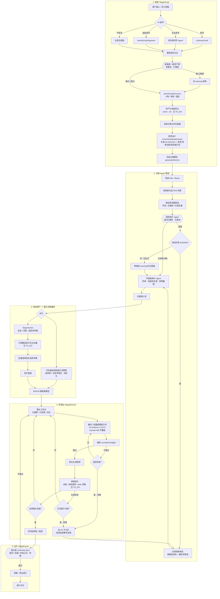

# 生产全流程：剧本 → 分镜 → 视频 → 出片

目标态管线（含已落地节点与待做优化）。现状与差距见文末。

相关待办：[TO_DO.md · 结构审片 Agent](./TO_DO.md#结构审片-agent允许删并镜与-beat-重排待做)

## 流程图（目标态）

## 设计原则

1. **结构审在前，字段审在后**：叠戏/缺转场先删并重排；字段级审片只做终审或对受影响镜增量审，避免白跑。
2. **故事层先于分镜**：改写/续写后的大纲缺口尽量在进 `generateShotList` 前拦住，少造废镜。
3. **视觉设计先于分镜**：点击“生成分镜脚本”后，`handleAnalyze` 会进入 `visuals` 阶段，由 `enrichScriptDataVisuals` 生成全局 `Art Direction`，并据此生成角色、场景、道具的视觉提示词；StageAssets 再使用这些提示词生成参考图。单独点击“AI 改写”只更新 `rawScript`，不会生成角色设计提示词。
4. **资产与视频提示词可并行**：分镜定稿后即可编草稿提示词；参考图齐备后再升为 Ref2VA 硬依赖。
5. **视频失败可回流**：连续预检失败或可归因的成片失败，标镜并触发局部重写，而不是只停在改 prompt。
6. **出片前再过一次成片级检查**：与分镜结构审分工——前者管叙事结构，后者管跳切/音画/失败占位。

## 审片 / 门禁分层

| 层级 | 时机 | 能力 | 现状 |
|------|------|------|------|
| 故事层一致性门禁 | 导演 plan 之后、场景分镜前 | 相对大纲查缺口（软警告） | **已落地** |
| 确定性管线 | 分镜生成后立刻 | 必填字段、关键帧、同场景 action 文案全重复 | 已有 |
| **结构审片** | 确定性管线之后、字段审之前 | 删/并/重排；autoSafe 自动应用 | **已落地** |
| 字段级审片 | 结构稳定后 | 改 action/对白/运镜/关键帧文案；不增删镜 | 已有 |
| 视频回流 | 预检/成片连续失败 | 标 H3 不可行 → 局部重写 | 待做 |
| 成片 continuity | 导出前 | 跳切、音画、失败镜占位 | 待做 |

## 路径说明

- **直接分镜出视频**：跳过改写走 `A5 → A6b…`；故事门禁可跳过（关闭质量校验时一并关闭）。
- **视觉设计生成**：主路径是“生成分镜脚本”按钮内部的 `handleAnalyze → visuals`：`enrichScriptDataVisuals` 先调用 `generateArtDirection`，再调用角色/场景/道具视觉提示词生成；其结果写入 `scriptData.artDirection` 与各资产的 `visualPrompt`。
- **AI 改写的边界**：`handleRewriteScript` 只负责改写并保存 `rawScript`；它不会自动接着执行结构解析、视觉设计或分镜生成。改写后需要再点击“生成分镜脚本”，才会进入上述完整流程。
- **视觉设计补偿路径**：如果主路径没有生成或项目切换了视觉风格，`StageAssets` 在生成资产前检查 `scriptData.artDirection`，必要时重新生成并保存，然后生成对应资产提示词。
- **`manual-edit` 提示词**：批量重建不得覆盖用户手改。
- **尚未落地**：资产∥提示词并行、视频失败回流、出片 continuity、结构提案人工确认闸、`regenerateBeat` 真重生成。

## 相对旧图的调整摘要

| 项 | 旧图 | 当前 |
|----|------|------|
| 审片顺序 | 仅字段审 | 结构审 → 字段终审 |
| 剧本后 | 直接 parse | 分镜前故事层软门禁 |
| 视觉设计 | 位置不明确 | `enrichScriptDataVisuals` 在分镜前生成 Art Direction 与资产 visualPrompt |
| 结构叠戏 | 无法自动修 | autoSafe 删/并/重排 |
| 资产 vs 提示词 | 严格串行 | 仍串行（并行待做） |
| 预检/成片失败 | 停在改 prompt | 回流待做 |
| 出片 | 一框「拼接/导出」 | continuity 待做 |
