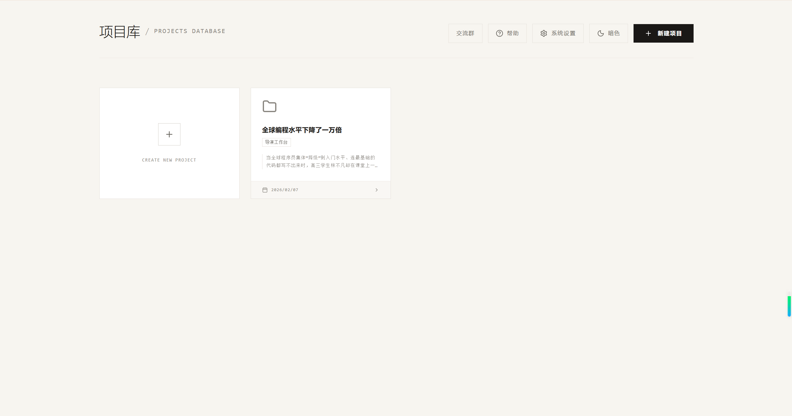
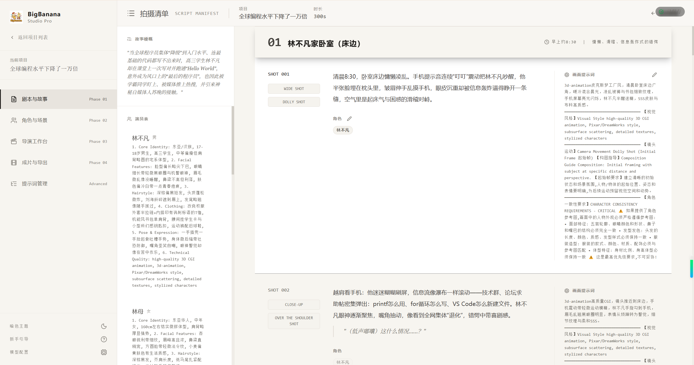
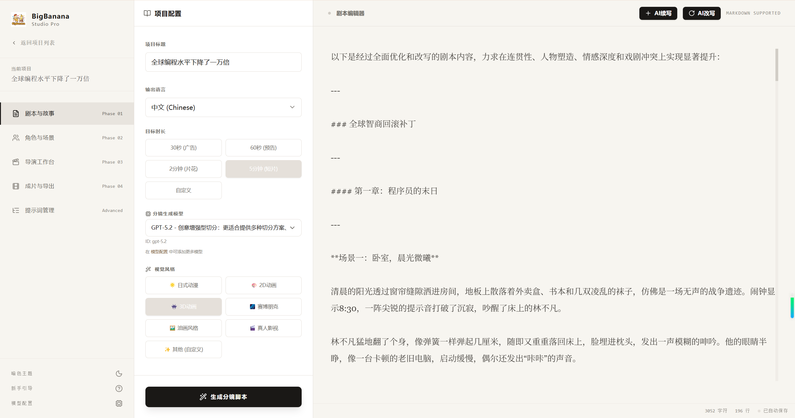
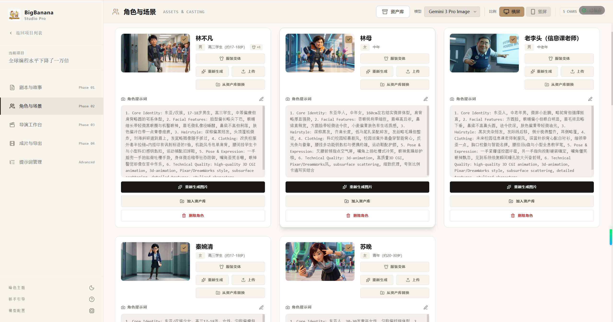
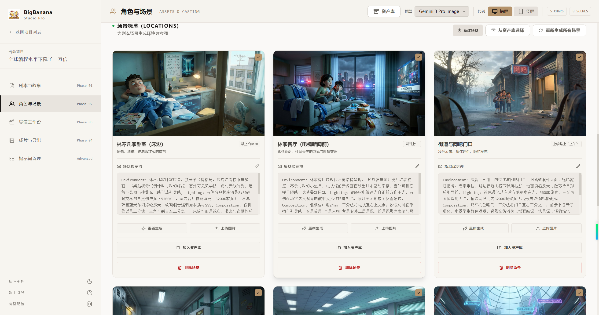
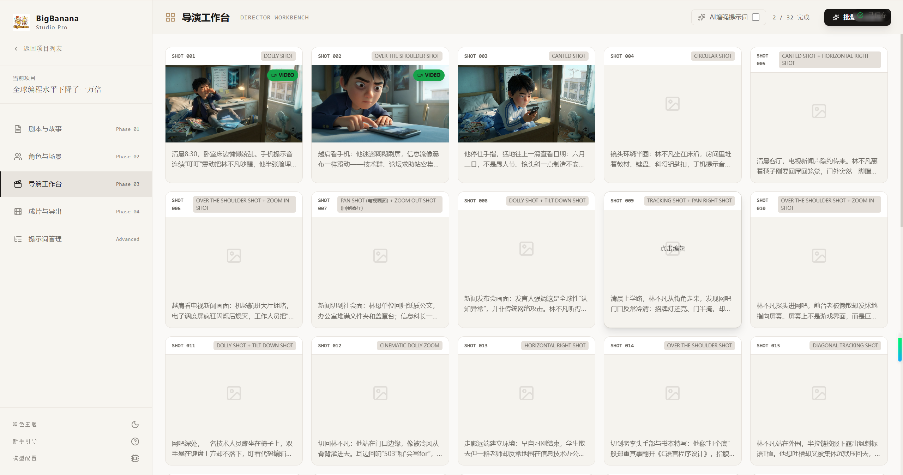
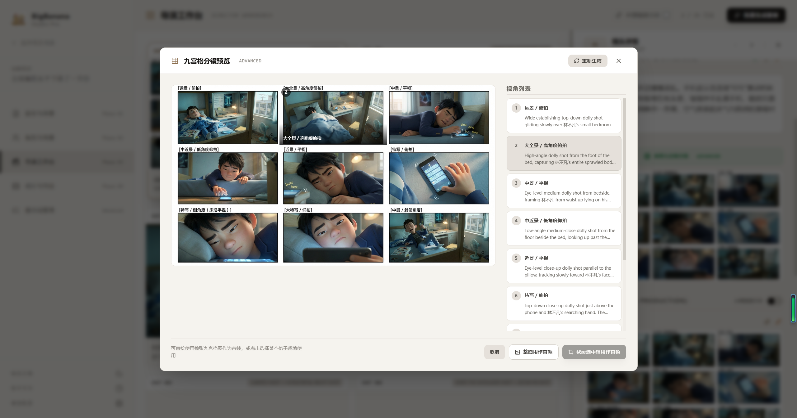
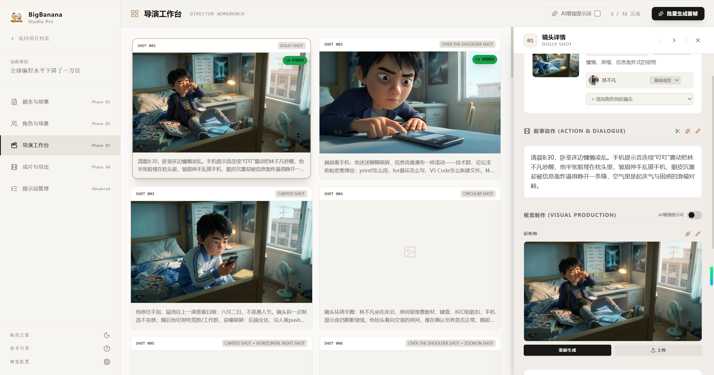
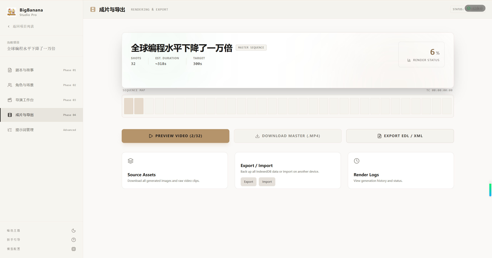

# AI Director（AI 漫剧工场）

> **AI 一站式短剧/漫剧生成平台**

[](https://opensource.org/licenses/MIT)

**AI Director** 是一个面向创作者的 AI 漫剧/短剧生产平台，采用 **Script → Asset → Keyframe → Video** 工业化工作流，从剧本到成片全程可控。

## 界面展示

### 项目管理


### Phase 01: 剧本与分镜



### Phase 02: 角色与场景资产



### Phase 03: 导演工作台




### Phase 04: 成片导出


## 核心能力

- **剧本拆解**：故事大纲 → 场次 / 分镜 / 提示词
- **资产定妆**：角色、场景、道具一致性管理
- **关键帧驱动**：首帧 / 尾帧控制，再生成视频
- **ComfyUI 工作流**：本地图片 / 视频模型接入
- **云端协作**：Next.js 前端 + FastAPI 后端 + SQLite

## 技术架构

| 层 | 目录 | 技术 |
|---|---|---|
| 前端 | `front-end/` | Next.js 16 + shadcn/ui |
| 后端 | `back-end/` | FastAPI + SQLite |
| 存储 | — | MinIO（可选） |
| 任务队列 | — | Redis + Celery（可选） |

## 项目启动

### 1. 首次安装

```bash
git clone <your-repo-url>
cd ai-director

# 前端（Node.js）
cd front-end && npm install && cp -n .env.example .env.local && cd ..

# 后端（Python）
cd back-end
python3 -m venv .venv && source .venv/bin/activate
pip install -r requirements.txt
cp -n .env.example .env
```

### 2. 启动（2～3 个终端）

**终端 1 — 后端 API**

```bash
cd back-end && source .venv/bin/activate
uvicorn app.main:app --reload --host 127.0.0.1 --port 8000
```

**终端 2 — Celery Worker（可选，需 Redis，视频异步任务）**

```bash
cd back-end && source .venv/bin/activate
celery -A app.workers.celery_app.celery_app worker --loglevel=info
```

**终端 3 — 前端**

```bash
cd front-end && npm run dev
```

浏览器访问 http://localhost:3000

### 3. 可选：本地代理

```bash
cd front-end
npm run media-proxy      # :8787
npm run comfyui-proxy    # :8789
```

## 快速开始

1. 注册 / 登录账号
2. 在「模型配置」中填写 **API Base URL** 与 **API Key**
3. 创建项目 → 进入 Episode 工作台
4. 按阶段完成：剧本 → 资产 → 导演 → 导出

## 许可证

MIT License
